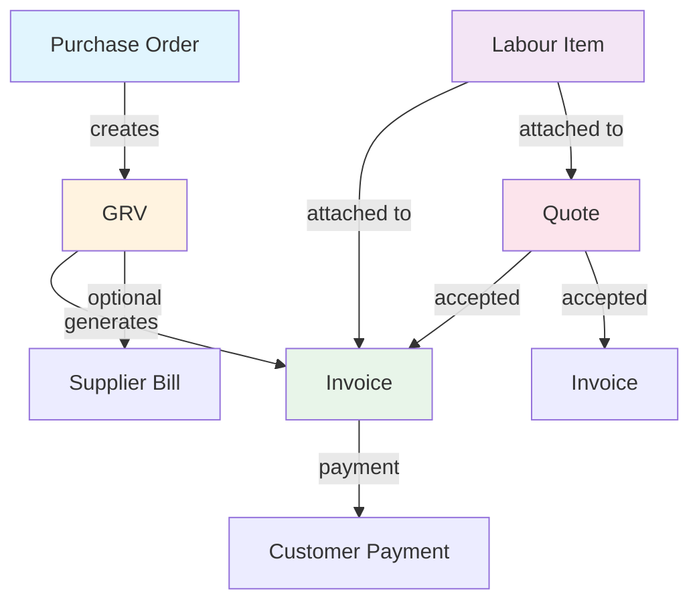
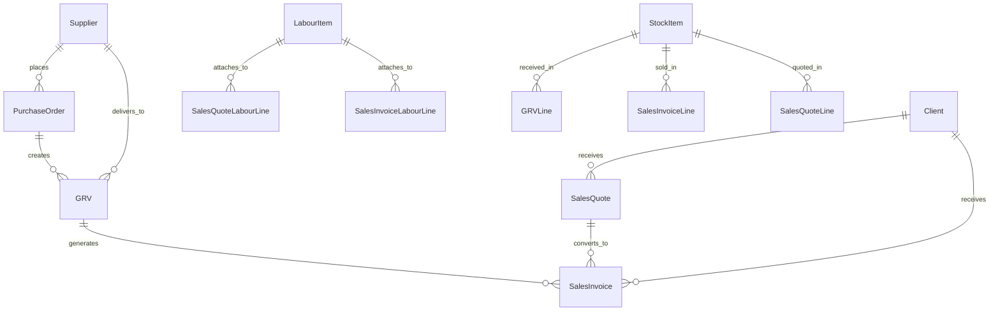
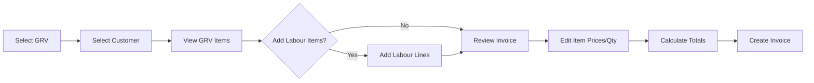

# GRV-Purchase Order-Quote-Invoice System Refactor Architecture

## Executive Summary

This document outlines the backend architecture refactor for the GRV (Goods Received Voucher), Purchase Order, Quote, and Invoice system. The key change is that **stock is no longer stored in inventory** — items move directly from GRV to Invoice without being held as inventory.

##  Flow Diagram1. Document



### Flow Description

1. **Purchase Order → GRV**: PO is created and goods are received into GRV
2. **GRV → Invoice**: GRV items are converted to invoice (direct flow, no inventory)
3. **Quote → Invoice**: Accepted quotes can generate invoices
4. **Labour Items**: Attach to Quotes and Invoices as separate line items

## 2. Database Models

### 2.1 LabourItem (New Model)

```typescript
interface ILabourItem {
  _id: Types.ObjectId;
  companyId: Types.ObjectId;
  
  // Identification
  name: string;              // e.g., "Installation", "Consultation", "Repair"
  description: string;        // Detailed description of labour service
  
  // Pricing
  costCents: number;          // Internal cost (for profit calculation)
  priceCents: number;         // Selling price to customer
  unit: string;               // e.g., "hour", "day", "job", "each"
  
  // Tax
  vatRate: number;            // Default VAT rate (e.g., 15)
  isVatExempt: boolean;
  
  // Status
  isActive: boolean;
  
  // Audit
  createdBy: Types.ObjectId;
  updatedBy: Types.ObjectId;
  createdAt: Date;
  updatedAt: Date;
}
```

### 2.2 Unified Document Line Schema

To ensure consistency across all documents, we use a unified line structure:

```typescript
// Base document line that works for Stock Items, Labour Items, and Custom Items
interface DocumentLine {
  _id: Types.ObjectId;
  lineNo: number;
  
  // Item type discriminator
  itemType: 'stock' | 'labour' | 'custom';
  
  // Reference to source item (null for custom/free-form items)
  stockItemId: Types.ObjectId | null;      // Reference to StockItem
  labourItemId: Types.ObjectId | null;    // Reference to LabourItem
  
  // Item snapshot at time of document (audit trail)
  itemSnapshot: {
    sku: string;              // For stock items
    name: string;
    description: string;
    unit: string;
    vatRate: number;
    isVatExempt: boolean;
  };
  
  // Quantity and pricing
  quantity: number;
  unitPriceCents: number;     // Selling price (for invoices/quotes)
  unitCostCents: number;      // Cost price (for GRV/PO)
  
  // Discounts
  discountType: 'none' | 'percent' | 'amount';
  discountValue: number;
  discountCents: number;
  
  // Calculations
  subtotalCents: number;      // quantity * unitPrice - discount
  vatCents: number;
  totalCents: number;        // subtotal + vat
  
  // For GRV-specific fields
  receivedQty?: number;      // For GRV: actual received quantity
  orderedQty?: number;        // For GRV: quantity ordered
  batchNumber?: string;       // For GRV: batch tracking
  expiryDate?: Date;          // For GRV: expiry tracking
  varianceReason?: string;    // For GRV: variance handling
}

// Labour line specifically (attached to Quote/Invoice)
interface LabourLine {
  _id: Types.ObjectId;
  lineNo: number;
  
  // Always 'labour' for labour items
  itemType: 'labour';
  labourItemId: Types.ObjectId;
  
  // Snapshot from LabourItem
  itemSnapshot: {
    name: string;
    description: string;
    unit: string;
    vatRate: number;
    isVatExempt: boolean;
  };
  
  quantity: number;
  unitPriceCents: number;
  discountCents: number;
  subtotalCents: number;
  vatCents: number;
  totalCents: number;
}
```

### 2.3 Modified Models

#### PurchaseOrder (Existing - No Major Changes)

```typescript
interface IPurchaseOrder {
  _id: Types.ObjectId;
  companyId: Types.ObjectId;
  
  poNumber: string;
  supplierId: Types.ObjectId;
  
  // Status: DRAFT, SUBMITTED, APPROVED, SENT, PARTIALLY_RECEIVED, FULLY_RECEIVED, CLOSED, CANCELLED
  status: string;
  
  // Dates
  issuedAt: Date | null;
  expectedAt: Date | null;
  
  // Lines - PO-specific (uses unitCostCents for supplier pricing)
  lines: POLine[];
  
  // Totals
  subtotalCents: number;
  taxCents: number;
  grandTotalCents: number;
  
  notes: string;
  
  // Audit
  createdBy: Types.ObjectId;
  updatedBy: Types.ObjectId;
  createdAt: Date;
  updatedAt: Date;
}
```

#### GRV (Modified - No Inventory Update)

**Key Change**: GRV no longer updates inventory. It only records received items.

```typescript
interface IGRV {
  _id: Types.ObjectId;
  companyId: Types.ObjectId;
  
  grvNumber: string;
  supplierId: Types.ObjectId;
  
  // Link to PO (optional)
  poId: Types.ObjectId | null;
  poNumber: string | null;   // Populated
  
  // Reference info
  referenceType: 'none' | 'po' | 'supplier_invoice' | 'delivery_note';
  referenceNumber: string;
  
  // Location (for record-keeping only, not inventory)
  locationId: string;
  locationName: string;
  
  // Dates
  receivedAt: Date;
  postedAt: Date | null;
  
  // Status: DRAFT, POSTED, CANCELLED
  status: 'DRAFT' | 'POSTED' | 'CANCELLED';
  
  // Lines - GRV-specific
  lines: GRVLine[];
  
  // Totals
  subtotalCents: number;
  vatTotalCents: number;
  discountTotalCents: number;
  grandTotalCents: number;
  
  // Notes
  notes: string;
  
  // Posted by
  postedBy: Types.ObjectId | null;
  
  // Audit
  createdBy: Types.ObjectId;
  updatedBy: Types.ObjectId;
  createdAt: Date;
  updatedAt: Date;
}

// GRV Line
interface GRVLine {
  _id: Types.ObjectId;
  lineNo: number;
  
  // Item reference
  stockItemId: Types.ObjectId;
  itemSnapshot: {
    sku: string;
    name: string;
    unit: string;
    vatRate: number;
    isVatExempt: boolean;
  };
  
  // Quantities
  orderedQty: number;
  receivedQty: number;
  
  // Pricing (cost from supplier)
  unitCostCents: number;
  discountType: 'none' | 'percent' | 'amount';
  discountValue: number;
  
  // Calculations
  subtotalCents: number;
  vatAmountCents: number;
  totalCents: number;
  
  // Tracking (optional)
  batchNumber: string;
  expiryDate: Date;
  serialNumbers: string[];
  
  // Variance
  varianceReason: 'none' | 'damaged' | 'short_delivery' | 'wrong_item' | 'free_stock' | 'other';
  remarks: string;
}
```

#### SalesInvoice (Modified - GRV Source + Labour Items)

```typescript
interface ISalesInvoice {
  _id: Types.ObjectId;
  companyId: Types.ObjectId;
  
  invoiceNumber: string;
  clientId: Types.ObjectId;
  clientSnapshot: {
    name: string;
    email: string;
    phone: string;
    address: {
      line1: string;
      line2: string;
      city: string;
      provinceState: string;
      country: string;
      postalCode: string;
    };
  };
  
  // Status: draft, issued, partially_paid, paid, overdue, cancelled
  status: string;
  
  // SOURCE DOCUMENT REFERENCES
  sourceGrvIds: Types.ObjectId[];    // GRVs that created this invoice
  sourceQuoteId: Types.ObjectId | null;  // If converted from quote
  
  // Lines - NOW INCLUDES LABOUR ITEMS
  lines: InvoiceLine[];               // Stock items from GRV
  labourLines: LabourLine[];          // Labour items
  
  // Financial totals (combines stock + labour)
  totals: {
    stockSubTotalCents: number;       // Sum of stock item subtotals
    labourSubTotalCents: number;      // Sum of labour item subtotals
    subTotalCents: number;            // stockSubTotal + labourSubTotal
    vatTotalCents: number;             // Total VAT
    totalCents: number;                // Grand total
  };
  
  // Payment tracking
  amountPaidCents: number;
  balanceDueCents: number;
  
  // VAT
  vatMode: 'exclusive' | 'inclusive' | 'none';
  vatRateBps: number;
  
  // Dates
  issueDate: Date;
  dueDate: Date;
  issuedAt: Date | null;
  paidAt: Date | null;
  cancelledAt: Date | null;
  
  notes: string;
  
  // Audit
  createdBy: Types.ObjectId;
  updatedBy: Types.ObjectId;
  createdAt: Date;
  updatedAt: Date;
}
```

#### SalesQuote (Modified - Labour Items)

```typescript
interface ISalesQuote {
  _id: Types.ObjectId;
  companyId: Types.ObjectId;
  
  quoteNumber: string;
  clientId: Types.ObjectId;
  clientSnapshot: { /* same as invoice */ };
  
  // Status: draft, sent, accepted, rejected, expired
  status: string;
  
  // Lines - NOW INCLUDES LABOUR ITEMS
  lines: QuoteLine[];
  labourLines: LabourLine[];          // Labour items
  
  // Totals
  totals: {
    stockSubTotalCents: number;
    labourSubTotalCents: number;
    subTotalCents: number;
    vatTotalCents: number;
    totalCents: number;
  };
  
  // VAT
  vatMode: 'exclusive' | 'inclusive' | 'none';
  vatRateBps: number;
  
  // Validity
  validUntil: Date | null;
  
  // Timestamps
  sentAt: Date | null;
  acceptedAt: Date | null;
  rejectedAt: Date | null;
  
  notes: string;
  
  // Audit
  createdBy: Types.ObjectId;
  updatedBy: Types.ObjectId;
  createdAt: Date;
  updatedAt: Date;
}
```

## 3. Model Relationships



### Relationship Summary

| From | To | Relationship | Description |
|------|-----|--------------|-------------|
| PurchaseOrder | GRV | One-to-Many | PO can generate multiple GRVs |
| GRV | SalesInvoice | One-to-Many | GRV can generate multiple Invoices |
| SalesQuote | SalesInvoice | One-to-One | Quote converts to Invoice |
| Client | SalesQuote | One-to-Many | Client can have multiple Quotes |
| Client | SalesInvoice | One-to-Many | Client can have multiple Invoices |
| LabourItem | SalesQuote | One-to-Many | Labour can be in multiple Quotes |
| LabourItem | SalesInvoice | One-to-Many | Labour can be in multiple Invoices |
| StockItem | GRVLine | One-to-Many | Stock item appears in many GRVs |
| StockItem | SalesInvoiceLine | One-to-Many | Stock item appears in many Invoices |

## 4. Invoice Total Calculation Logic

### Formula

```
Invoice Total = Stock Items Total + Labour Items Total

Where:
Stock Items Total = Σ(quantity × unitPrice - discount + VAT)
Labour Items Total = Σ(quantity × unitPrice - discount + VAT)
```

### Detailed Calculation

```typescript
interface InvoiceTotals {
  // Stock items calculation
  stockSubTotalCents: number;    // Σ(line.quantity × line.unitPriceCents - line.discountCents)
  stockVatCents: number;          // Σ(stock line VAT amounts)
  stockTotalCents: number;        // stockSubTotal + stockVat
  
  // Labour items calculation  
  labourSubTotalCents: number;   // Σ(labour.quantity × labour.unitPriceCents - labour.discountCents)
  labourVatCents: number;        // Σ(labour VAT amounts)
  labourTotalCents: number;      // labourSubTotal + labourVat
  
  // Combined totals
  subTotalCents: number;         // stockSubTotal + labourSubTotal
  vatTotalCents: number;         // stockVat + labourVat
  totalCents: number;            // subTotal + vatTotal = stockTotal + labourTotal
}

// VAT Calculation (per line)
function calculateLineVAT(subtotalCents: number, vatRate: number, isVatExempt: boolean): number {
  if (isVatExempt) return 0;
  return Math.round(subtotalCents * (vatRate / 100));
}

// Example:
// Stock Items: 2 x R100 = R200 (15% VAT = R30) = R230
// Labour Items: 3 x R150 = R450 (15% VAT = R67.50) = R517.50
// Total = R230 + R517.50 = R747.50
```

## 5. GRV to Invoice Conversion

### Process Flow



### Conversion Rules

1. **GRV Selection**: Select one or more GRVs to convert
2. **Customer Selection**: Select customer for the invoice
3. **Item Population**: All GRV items auto-populate into invoice
4. **Editable Fields**:
   - Quantity (can be reduced, not increased beyond received)
   - Unit Price (selling price, different from GRV cost price)
   - Discount (percentage or fixed amount)
   - VAT settings (per line)
5. **Labour Addition**: Optionally add labour line items
6. **Price Override**: All prices are editable - GRV stores cost, Invoice stores selling price

### Code Implementation

```typescript
interface GRVToInvoiceConversion {
  // Input
  grvIds: Types.ObjectId[];
  clientId: Types.ObjectId;
  labourItemIds?: Types.ObjectId[];  // Optional labour to add
  
  // Process
  convertToInvoice(): Promise<SalesInvoice>;
}

// Conversion logic
async function convertGRVToInvoice(grvIds: Types.ObjectId[], clientId: Types.ObjectId) {
  // 1. Fetch GRVs
  const grvs = await GRV.find({ _id: { $in: grvIds }, status: 'POSTED' });
  
  // 2. Fetch client
  const client = await Client.findById(clientId);
  
  // 3. Build invoice lines from GRV lines
  const lines = grvs.flatMap((grv, grvIndex) => 
    grv.lines.map((grvLine, lineIndex) => ({
      lineNo: calculateNextLineNo(),
      itemType: 'stock' as const,
      stockItemId: grvLine.stockItemId,
      itemSnapshot: grvLine.itemSnapshot,
      quantity: grvLine.receivedQty,      // Default to received qty
      unitPriceCents: getDefaultSellingPrice(grvLine.stockItemId), // From StockItem
      unitCostCents: grvLine.unitCostCents, // Keep for reference
      discountCents: 0,
      subtotalCents: 0,                    // Calculate
      vatCents: 0,                        // Calculate
      totalCents: 0,                      // Calculate
      sourceGrvId: grv._id,
      sourceGrvLineId: grvLine._id,
    }))
  );
  
  // 4. Calculate initial totals
  const totals = calculateInvoiceTotals(lines, []);
  
  // 5. Create invoice
  const invoice = new SalesInvoice({
    invoiceNumber: await generateInvoiceNumber(),
    clientId,
    clientSnapshot: captureClientSnapshot(client),
    sourceGrvIds: grvIds,
    lines,
    labourLines: [],
    totals,
    status: 'draft',
    // ... other fields
  });
  
  return invoice;
}
```

## 6. Best Practices Used

### 6.1 Normalized Models

- **Separate Concerns**: Each model has a single responsibility
- **Reference Integrity**: Foreign keys properly indexed
- **Audit Trail**: Snapshots capture state at transaction time
- **Soft Delete**: All models support soft delete via `isDeleted` flag

### 6.2 Reusable Item Structures

- **Unified Line Schema**: Stock and Labour items share common structure
- **Type Discriminator**: `itemType` field distinguishes item categories
- **Snapshot Pattern**: Items capture state at document creation for audit

### 6.3 Extensible Document System

- **Custom Items**: Support for free-form line items (no source reference)
- **Flexible Pricing**: Multiple discount types (none, percent, amount)
- **Tax Handling**: Per-line VAT with exemption support
- **Status Workflows**: Document lifecycle management

### 6.4 Additional Best Practices

| Practice | Implementation |
|----------|----------------|
| Money Handling | All amounts in cents (integer) to avoid floating-point issues |
| Company Isolation | All models include `companyId` for multi-tenancy |
| Indexing | Compound indexes for common query patterns |
| Validation | Server-side calculation of totals (never trust client) |
| Numbering | Centralized document numbering system |

## 7. API Endpoints (Proposed)

### Labour Items

| Method | Endpoint | Description |
|--------|----------|-------------|
| GET | /api/labour-items | List all labour items |
| POST | /api/labour-items | Create labour item |
| GET | /api/labour-items/[id] | Get labour item |
| PUT | /api/labour-items/[id] | Update labour item |
| DELETE | /api/labour-items/[id] | Delete labour item |

### Invoice from GRV

| Method | Endpoint | Description |
|--------|----------|-------------|
| POST | /api/invoices/create-from-grv | Create invoice from GRV(s) |

### Quote with Labour

| Method | Endpoint | Description |
|--------|----------|-------------|
| POST | /api/quotes | Create quote with labour lines |
| PUT | /api/quotes/[id] | Update quote labour lines |

## 8. Migration Strategy

### Phase 1: Create Labour Model
1. Create LabourItem model
2. Create LabourItem API routes
3. Add labour management UI

### Phase 2: Modify Invoice/Quote
1. Add labourLines to SalesInvoice schema
2. Add labourLines to SalesQuote schema
3. Update total calculation logic
4. Update API routes

### Phase 3: GRV to Invoice Flow
1. Add sourceGrvIds to SalesInvoice
2. Create GRV-to-Invoice conversion endpoint
3. Update UI for invoice creation from GRV

### Phase 4: Remove Inventory Updates
1. Remove inventory update logic from GRV posting
2. Remove inventory movement creation
3. Update related services

## 9. Summary

This architecture provides:

1. **Clear separation** between stock and labour items
2. **Direct flow** from GRV to Invoice without inventory
3. **Flexible pricing** - cost (GRV) vs selling price (Invoice)
4. **Audit trail** via item snapshots
5. **Extensible design** for future item types
6. **Accurate calculations** combining stock + labour totals
